1\. CASS  . . . . . . . . . . . . . . . . . . . . . . . . . . . . . . . . . . . . . . . . . . . . . . . . . . . . . . . . . . . . . . . . . . . . . . . . . . . . . . . . . . . . . . . . . . . . . .  2

1. Introduction  . . . . . . . . . . . . . . . . . . . . . . . . . . . . . . . . . . . . . . . . . . . . . . . . . . . . . . . . . . . . . . . . . . . . . . . . . . . . . . . . . . . . .  2
1. Introduction to Contexts  . . . . . . . . . . . . . . . . . . . . . . . . . . . . . . . . . . . . . . . . . . . . . . . . . . . . . . . . . . . . . . . . . . . . . .  3
1. Introduction to Actors  . . . . . . . . . . . . . . . . . . . . . . . . . . . . . . . . . . . . . . . . . . . . . . . . . . . . . . . . . . . . . . . . . . . . . . . .  5
1. Introduction to States  . . . . . . . . . . . . . . . . . . . . . . . . . . . . . . . . . . . . . . . . . . . . . . . . . . . . . . . . . . . . . . . . . . . . . . . .  7
1. Introduction to Services  . . . . . . . . . . . . . . . . . . . . . . . . . . . . . . . . . . . . . . . . . . . . . . . . . . . . . . . . . . . . . . . . . . . . . . .  8
1. How DataFields work?  . . . . . . . . . . . . . . . . . . . . . . . . . . . . . . . . . . . . . . . . . . . . . . . . . . . . . . . . . . . . . . . . . . . . . . .  10
1. How does this look in Unity?  . . . . . . . . . . . . . . . . . . . . . . . . . . . . . . . . . . . . . . . . . . . . . . . . . . . . . . . . . . . . . . . . . . .  13
1. Standard State Types  . . . . . . . . . . . . . . . . . . . . . . . . . . . . . . . . . . . . . . . . . . . . . . . . . . . . . . . . . . . . . . . . . . . . . . . .  15
1. GOInstance  . . . . . . . . . . . . . . . . . . . . . . . . . . . . . . . . . . . . . . . . . . . . . . . . . . . . . . . . . . . . . . . . . . . . . . . . . . . . . . . .  23
1. Actor Using An Actor  . . . . . . . . . . . . . . . . . . . . . . . . . . . . . . . . . . . . . . . . . . . . . . . . . . . . . . . . . . . . . . . . . . . . . . . . .  23
2. StateMachine Implementation  . . . . . . . . . . . . . . . . . . . . . . . . . . . . . . . . . . . . . . . . . . . . . . . . . . . . . . . . . . . . . . . . . . . . . .  27
3. AS\_ActorRunner Implementation  . . . . . . . . . . . . . . . . . . . . . . . . . . . . . . . . . . . . . . . . . . . . . . . . . . . . . . . . . . . . . . . . . . . .  32
3. An example  . . . . . . . . . . . . . . . . . . . . . . . . . . . . . . . . . . . . . . . . . . . . . . . . . . . . . . . . . . . . . . . . . . . . . . . . . . . . . . . . . . . . .  37

CASS

Welcome to the Context-Actor-State-Service (CASS) framework documentation.

CASS is a design pattern that provides a structured approach to organizing and implementing game logic. The framework is based on four key concepts: context, actor, state, and service. Each of these concepts plays a distinct role in managing game logic and can be combined in different ways to create a flexible and modular architecture.

The CASS framework is designed to be used in Unity game development but can be adapted to other game engines or software development projects. It is intended for use by game developers of all skill levels, from beginners to experts, and can be applied to a wide range of game genres and styles.

In this documentation, you will find an overview of the CASS framework, a detailed explanation of each concept, and examples of how to implement CASS in your Unity projects. I hope this documentation will help you to create well-structured, modular game logic that is easy to maintain and extend.

Introduction

Welcome to the Context-Actor-State-Service (CASS) framework documentation.

CASS is a design pattern that provides a structured approach to organizing and implementing game logic. The framework is based on four key concepts: context, actor, state, and service. Each of these concepts plays a distinct role in managing game logic and can be combined in different ways to create a flexible and modular architecture.

The CASS framework is designed to be used in Unity game development but can be adapted to other game engines or software development projects. It is intended for use by game developers of all skill levels, from beginners to experts, and can be applied to a wide range of game genres and styles.

In this documentation, you will find an overview of the CASS framework, a detailed explanation of each concept, and examples of how to implement CASS in your Unity projects. We hope this documentation will help you to create well-structured, modular game logic that is easy to maintain and extend.

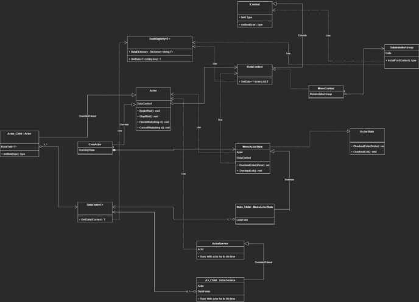

Introduction to Contexts

This is a type of structure that defines the scope of an event or data. It does this by associating itself with DataRegistry<T> and EventRegistry classes.

As you can see below, DataRegistry has a \_dictionary with a string key and a T value, which is the type of the object we want to hold

public static class DataRegistry<T>

{

`    `private static readonly Dictionary<string, T> \_dictionary = new Dictionary<string, T>();

`    `public static Dictionary<string, T> Dictionary => \_dictionary;

The string value is concatenated using the formula below:

\_stringBuilder.Append(contextID); \_stringBuilder.Append("/"); \_stringBuilder.Append(key);

Each context must implement the ContextID string. In most cases, if this is a Unity object, it will be its instance ID.

public interface IContext : ICastable

{

`    `string ContextID { get; }

`    `void InitializeIfNot();

`    `event Action<IContext> onDestroyContext; }

Here is an example of the implementation inside a concrete context:

`    `[ShowInInspector] [ReadOnly] private string \_instanceID;     public string ContextID => \_instanceID;

We set the \_instanceID on initialization:

\_instanceID = \_isSceneContext ? gameObject.scene.name : GetInstanceID().ToString();

We use our DataInstallers to install the data to the DataRegistry based on the given context. Here is an example of a method inside a DataInstaller<T>:

public void InstallFor(IDataContext main)

{

`    `string key = Key ? Key.ID : "";

`    `if (InstalledValue == null && InstalledValue is not UnityEngine. Object)

`    `{

`        `InstalledValue = Activator.CreateInstance<T>();

`    `}

`    `DataRegistry<T>.SetData(main,InstalledValue,key);

}

These installers are stored inside the DataInstallerGroup.

public abstract class DataInstallerGroup : MonoBehaviour, IDataInstaller {

`    `public void InstallFor(IDataContext dataContext)

`    `{

`        `foreach (IDataInstaller installer in GetInstallers())

`        `{

`            `installer.InstallFor(dataContext);

`        `}

`    `}

`    `protected abstract IEnumerable<IDataInstaller> GetInstallers(); }

Now we have to implement the GetInstallers method.

By overriding this class (which is a MonoBehaviour) and assigning it to the installer method field on the concrete data context, we can ensure that our data will be installed properly during initialization.

Here is an example:

public class DIG\_String : DataInstallerGroup

{

`    `[SerializeField] private DataInstaller<string> \_string;

`    `protected override IEnumerable<IDataInstaller> GetInstallers()     {

`        `yield return \_string;

`    `}

}

In this example, we will be installing a string data. Whether this is a Singleton install or a Key-based install depends on the setup in the editor. To summarize up to this point:

We have a group of data installers that we have configured to address how a data gets installed. We then slot this group into the concrete data context, which will call the InstallFor method during initialization. This results in the data being installed on the DataRegistry with a string formula.

To retrieve the data, see the states, services, and actor sections.

Introduction to Actors

Actors are responsible for executing the primary logic. They associate themselves with IDataContext and IEventContext. Actors can also have DataField fields, which can be used to extract data from the associated context.

Extending an actor should only be considered if there is concrete evidence that the newly implemented actor will have a significant performance or convenience impact. This process must only be considered during the later stages of the development process when all elements have found their place. This is because actors are designed to be used by their named type rather than by installed bindings. Before extending an actor, it is important to consider implementing any kind of extension by ActorService.

Most of the time, you will be using SimpleActor, which only results in running the listening services. Alternatively, you can use CoreActor, which has a state-oriented approach.

In the case of CoreActor, during initialization, it will first initialize the associated contexts. Then, it will fire up events that can be used for modularity reasons.

[Button][ShowIf("ShowInitButton")] public void InitializeIfNot()

{

`    `if (\_isInitialized) return;

`    `if (\_setSceneReference)

`    `{

`        `\_sceneInstall.InstalledValue = this;

`        `\_sceneInstall.InstallFor(ContextRegistry.GetContext(gameObject. scene.name).As<IDataContext>());

`    `}

`    `\_goPool = DataRegistry<IGOInstancePoolRegistry>.GetData(null);     OnBeforeContextsInitialize();

`    `\_dataContext = \_dataContextObject as IDataContext;

`    `\_dataContext.onDestroyContext += OnDestroyDataContext;

`    `\_dataContext.InitializeIfNot();

`    `\_dataContext.SetData(this as IActor);

`    `OnAfterActorInstalledItself();

`    `\_eventContext = \_eventContextObject as IEventContext;     \_eventContext.InitializeIfNot();

`    `OnAfterContextsInitialized();

`    `\_isInitialized = true;

`    `onInitialize?.Invoke(this);

}

At the 16th line, the actor sets the IActor type of data, using itself, for the data context. This installs the Actor as a singleton in the associated context. Subsequently, this can be used to obtain the Actor of this Context if the only thing we have is the context, without requiring any GetComponent operation or casting.

It's important to note that all these public functions must be called from outside. An actor cannot initialize or run itself. It will only assign itself to a group on Awake.

` `protected void Awake()

{

`    `foreach (Key group in \_groups)

`    `{

`        `if (!DataRegistry<List<IActor>>.ContainsData("Global/"+group. ID))

`        `{

`            `DataRegistry<List<IActor>>.SetData(null,new List<IActor>(), group.ID);

`        `}

`        `DataRegistry<List<IActor>>.GetData(null, group.ID).Add(this);     }

}

By pulling these group data from other actors and their states, we can obtain a list of actors and initialize them. Group examples include the Player group, Enemy group, LevelFlow group, CameraHandling group, and others. However, every process needs a starting point, which is where the FirstSpark script comes in.

The implementation of the Start function inside the FirstSpark MonoBehaviour is as follows:

private IEnumerator Start()

{

`    `yield return null;

`    `Application.targetFrameRate = 60;     \_actor.InitializeIfNot();

`    `\_actor.BeginIfNot();

}

Typically, the FirstSpark actor will trigger the running of other actors, such as LevelFlow, and LevelFlow will likely trigger the Player, Enemy, and other actors. This approach allows for trackable execution based on the confirmed status of the application.

Additionally, CoreActor has a RunningState, which will be entered when BeginIfNot is called and exited when StopIfNot is called. For more information on States, please refer to the pages about states.

Additionally, actors can be finished or cancelled. This status is implemented for logic that runs while the actor's job is finished but still has remaining cleanup processes or fade outs. For example, audio or particle effects stopping after one second and smoothly fading out instead of being abruptly cut off.

You can enable this behavior by unticking the \_stopOnFinish boolean. However, now you have to manage stopping the actor on its finish.

Introduction to States

States are the most usable and modular way of implementing any kind of logic. By their design, they cannot be reached by their implemented type.

Their design is to be override-inheritance.

States can only be entered by giving a scope of actor, as seen below:

public void CheckoutEnter(IActor actor) {

`    `if (\_isRunning) return;

`    `\_isRunning = true;

`    `\_isFinished = false;

`    `InsertActor(actor);

`    `OnGetData();

`    `OnEnter();

}

The InsertActor method will get the DataContext and EventContext and set it to be used by the state. OnGetData is a virtual method so that you can override it to get your initial data when it's appropriate. OnEnter is where you implement enter logic.

OnExit is where you implement exit logic.

Here is an example for a state

public class State\_SetCameraState : MonoActorState

{

`    `[SerializeField] private DataField<string> \_cameraState;

`    `[SerializeField] private string \_aimCameraState = "Shooting";     [SerializeField] private bool \_onExitSetPreviousState = true;     private string \_previousCameraState;

`    `protected override void OnGetData()     {

`        `\_cameraState.Get(DataContext);

`    `}

`    `protected override void OnEnter()

`    `{

`        `base.OnEnter();

`        `\_previousCameraState = \_cameraState.Data;

`        `\_cameraState.Set(DataContext,\_aimCameraState);     }

`    `protected override void OnExit()

`    `{

`        `base.OnExit();

`        `if (\_onExitSetPreviousState)

`        `{

`            `\_cameraState.Set(DataContext,\_previousCameraState);         }

`    `}

}

In this example, we have a DataField<string> that we will use to pull data from the assigned DataContext provided by the actor that has entered. We also have on-state or transient data like \_aimCameraState and \_onExitSetPreviousState.

OnGetData, we are retrieving the current value of data by \_cameraState.Get(DataContext).

OnEnter, we are setting it to be used as the previous state of the camera. We then assign the new camera state by using the Set function of DataField<string>.

OnExit, we are returning to the previous state only if a boolean is true.

We could register to an Update, FixedUpdate, or any other event on enter and then unregister on exit. The possibilities with combinations are limitless.

This is how States work. Only they know what they need and what they should listen to. Nothing outside should reach them and change their internal behavior.

For more information on DataFields, check its page.

Introduction to Services

Services, like states, are also used for logic running. So, what's the difference?

The difference is that services are designed to be used for the logic that will exist for the lifetime of an Actor. Because of this, they are also, by design, allowed to install themselves to the context as behaving like data. They can both hold data and run logic.

For example, take the MovementService.

public class AS\_MovementHandler : ActorService

{

`    `[ShowInInspector]

`    `[ReadOnly]

`    `private float \_groundDistance;

`    `[SerializeField] private float \_groundCheckDistance = 100f;

`    `[SerializeField] private float \_groundedDistance = 0.3f;

`    `[SerializeField] private float \_gravityTowardsGround = -9.81f;     [SerializeField] private DataField<D\_MovementHandler> \_movementSettings;

`    `[SerializeField] private DataField<D\_MovementStatus> \_movementStatus;

`    `[SerializeField] private ConfiguredUpdateField \_moveUpdate;

`    `private CapsuleCollider CapsuleCollider => \_movementStatus.Data. CapsuleCollider;

`    `private float ExternalForceDecayRate => \_movementSettings.Data. ExternalForceDecayRate;

`    `private float ExternalForceContributionFactor => \_movementSettings. Data.ExternalForceContributionFactor;

`    `private float MaxSlopeAngle => \_movementSettings.Data.MaxSlopeAngle;     private LayerMask GroundLayerMask => \_movementSettings.Data. GroundLayerMask;

…..

public void Move()

{

`    `CheckGround();

`    `Vector3 targetVelocity = \_movementStatus.Data.DesiredMoveVelocity;

`    `CalculateExternalForces();

`    `if (IsOnWalkableGround)

`    `{

`        `Vector3 resultingVelocity = Vector3.Lerp(targetVelocity, targetVelocity + \_externalForce, ExternalForceContributionFactor);

`        `Vector3 characterUp = Actor.transform.up;

`        `Vector3 lateralVelocity = Vector3.ProjectOnPlane (resultingVelocity, characterUp);

`        `Vector3 reprojected = Quaternion.FromToRotation(characterUp, GroundNormal)\*lateralVelocity;

`        `Rigidbody.velocity = reprojected;

`    `}

`    `else

`    `{

`        `Vector3 resultingVelocity = Vector3.Lerp(targetVelocity, targetVelocity + \_externalForce, ExternalForceContributionFactor);

`        `Rigidbody.velocity = resultingVelocity + Vector3.up \* \_gravityTowardsGround;

`    `}

`    `\_movementStatus.Data.CurrentPhysicsVelocity = Rigidbody.velocity;     \_movementStatus.Data.VelocityOutput = Rigidbody.velocity;

`    `\_externalForceThisFrame = Vector3.zero; }

They are pulling data, they have their own data, and they are also an extend-inheritance implementation. Too powerful.

Yes, but the keyword 'lifetime' is very important. This means that in any of the time or the majority of the time of an actor's lifetime, this service will be used. This is why it's a service.

We could definitely implement this behavior by making a state, but we would have to deal with event configurations and on-state data that makes things just complicated and not as simple or modular.

By making this service, we can register it to the context and get it from states to use or change its behavior and data. Alternatively, it can have its own always running behavior.

The ActorService approach can also be used to move development faster in the early stages without needing to implement states and worry about their configurations.

In later stages, their behaviors can be separated into states or turned into a whole Actors.

They are jacks of all trades and will make things move faster, as long as you keep it to the rule of an actor's lifetime.

How DataFields work?

DataFields are used to retrieve and modify data of a context scope relative to the given context. The first selection defines:

public enum DataAddress {

`    `Context = 0,

`    `Global = 1,

`    `GroupFirstMember = 2 }

Here, we are defining our strategy to find data. If it's a context-based address;

public enum ContextAddress {

`    `Self = 0,

`    `Parent=1,

`    `Root=2,

`    `Scene=3,

`    `Relative = 4

}

"We will have 5 selections:

- Self: data will be retrieved from the scope of the given context.
  - Parent: data will be retrieved from the scope of the given context's parent.
    - Root: data will be retrieved from the root based on this operation below:"

public IContext RootContext

{

`    `get

`    `{

`        `IHierarchyContext latestHierarchyContext = this;

`        `IContext latestContext = this;

`        `bool isFinal = false;

`        `while (!isFinal)

`        `{

`            `IContext iteration = latestHierarchyContext.ParentContext;             if (iteration == null)

`            `{

`                `isFinal = true;

`            `}

`            `else

`            `{

`                `latestContext = iteration;

`                `latestHierarchyContext = latestContext as IHierarchyContext;

`                `if (latestHierarchyContext == null) break;

`            `}

`        `}

`        `return latestContext;     }

}

Here, we are getting to the root until the parent becomes null.

- Scene: data will be retrieved from the Scene context. Remember how we assign a context ID on the data context.
  - Relative: A stack of data keys that are used to set context will be given, and by moving from one another, we get to the end of the stack. That end of the stack will be our scope.

Consider this method:

private IContext RecursiveGetRelativeAtAddress(IContext relationOwner, List<DataKey> stack, int currentIndex)

{

`    `if (stack.Count <= currentIndex)

`    `{

`        `return null;

`    `}

`    `if (relationOwner.ContainsData<IContext>(stack[currentIndex].ID))

`    `{

`        `IContext main = relationOwner.GetData<IContext>(stack [currentIndex].ID);

`        `IContext nextOwner = main;

`        `IContext recurse = RecursiveGetRelativeAtAddress(nextOwner, stack, currentIndex + 1);

`        `if (recurse != null)

`        `{

`            `main = recurse;

`        `}

`        `return main;     }

`    `return null;

}

As you can see, we recursively move forward. This is like saying 'My Uncle's Son's Friend.'

This stack would be [Uncle, Son, Friend]. By finding Uncle at our context, we get it and use it to get the Son. By using that context, we get the Friend.

This is useful if your ability actor needs to reach your Root actor's Character's Weapon to get its damage or size, etc. By using the Get method, this sequence-defined configuration will run, and we will get the appropriate data.

The Set method can also be used to modify data in the same way.

How does this look in Unity?

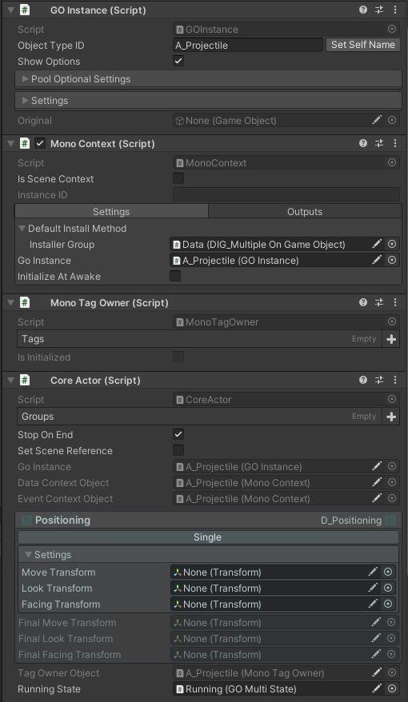

Above is a projectile actor that has movement behavior when released from a launcher. For more information on GOInstance, check out its page.

As you can see above, these will be automatically retrieved and set in their appropriate place.

We also have a running state slotted, which is a GOMultiState. For more information about State types, check out its page.

We also have D\_Positioning data, which is used to share main transform use cases like Move, Look, and Facing. Move is used in distance calculations and movement calculations, etc.

Look is generally used for IK and AI behaviors.

Facing is generally used for Rotation and Animation behaviors.

Standard State Types

We have some state types already implemented for certain use cases;

**GOMultiState**

The most common state you will see is GOMultiState.

It will detect every state on the GameObject that it sits on and enter/exit them when it gets entered/exited.

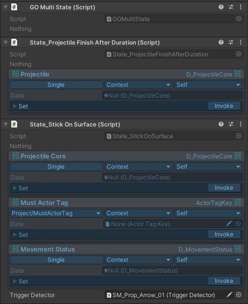

As we can see above, two states underneath GOMultiState will be entered/exited when it gets entered/exited.

**State\_Redirect**

We also have a state that lets us redirect enter/exit to another state - State\_Redirect.

This is useful when using modular prefabs that have a group of states that need to run exactly in the order they are configured.

Here we can see the combination of GOMultiState and State\_Redirect.

Before running State\_DesiredFacingCalculation, a group of states that sit on MaintainCharacter GameObject will run.

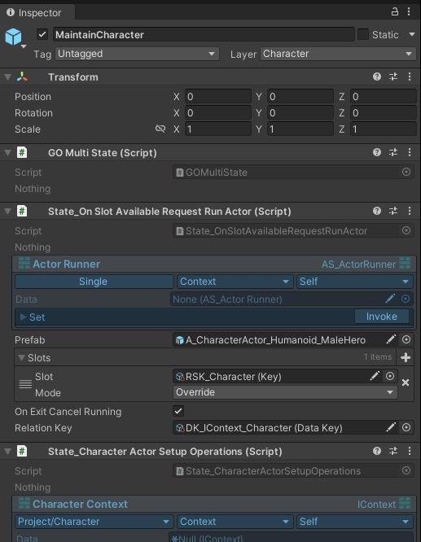

As you can see, there are a bunch of configured states here that will run before State\_DesiredFacingCalculation , if you remember from above.

So the new execution order will be:

State\_OnSlotAvailableRequestRunActor , State\_CharacterActorSetupOperations , and then finally, out of the redirect, we continue with State\_DesiredVelocityCalculation .

We also have the infamous FSMs;

**StateMachineMonoActorState**

For more information about state machine logic, please refer to its dedicated page. Here, we will only discuss how to implement it in an easy way.

public class FSM\_Living : StateMachineMonoActorState {

`    `private D\_Living Living => \_living.Data;

`    `[InfoBox("This state also manages data.")]

`    `[SerializeField] private DataField<D\_Living> \_living;     [SerializeField] private StateField \_initialState;

`    `[SerializeField] private StateField \_revive;

`    `[SerializeField] private StateField \_alive;

`    `[SerializeField] private StateField \_dying;

`    `[SerializeField] private StateField \_dead;

`    `protected override IActorState InitialState => \_initialState.State;

We start by defining a DataField that we will be using, in this case we are using D\_Living.

Multiple DataFields can be defined based on specific requirements.

Then we define StateFields, which are used to store states configured in the editor. For more information about StateFields, see its page.

After that, we override InitialState to configure it. Conditional approaches can also be used here, but it is generally recommended to support an initial state.

protected override void OnGetData() {

`    `base.OnGetData();

`    `\_living.Get(DataContext);

}

protected override void OnEnter()

{

`    `base.OnEnter();

`    `\_living.Data.onLivingDataChanged += OnLivingDataChanged;     Evaluate();

}

protected override void OnExit()

{

`    `base.OnExit();

`    `\_living.Data.onLivingDataChanged -= OnLivingDataChanged; }

private void OnLivingDataChanged(D\_Living obj) {

`    `Evaluate();

}

We continue fairly simple as you can see.

We register for data change updates of Living data, and when it changes we tell FSM to evaluate transitions.

But we also have to configure transitions.

protected override void OnGetTransitions()

{

`    `AddDirectTransition(\_initialState.State,\_alive.State, ConditionToStartAlive);

`    `AddDirectTransition(\_initialState.State,\_dead.State, ConditionToStartDead);

`    `AddDirectTransition(\_alive.State,\_dying.State, ConditionFromAliveToDying);

`    `AddDirectTransition(\_dying.State,\_dead.State, ConditionFromDyingToDead);

`    `AddDirectTransition(\_dead.State,\_revive.State, ConditionFromDeadToRevive);

`    `AddDirectTransition(\_revive.State,\_alive.State, ConditionFromReviveToAlive);

}

private bool ConditionToStartAlive()

{

`    `return Living.IsAlive;

}

private bool ConditionToStartDead()

{

`    `return Living.IsDead;

}

private bool ConditionFromAliveToDying()

{

`    `bool shouldDie = Living.ShouldDieTrigger;     if (shouldDie)

`    `{

`        `Living.ShouldDieTrigger = false;

`        `Living.IsDying = true;

`    `}

`    `return shouldDie;

}

Above, you can see the override implementation of OnGetTransitions().

We use the AddDirectTransition method to add a FROM  TO transition with a Func<bool> that acts as a condition. You can also use AddAnyTransition to add an ANY  TO transition with a condition.

The difference between any and direct is that any conditions will always be evaluated regardless of the current state, and direct transitions will only be evaluated when the current state is the FROM state.

For fast branching state logic, you can also use: **BranchMonoActorState**

public class ActorTagBranchState : BranchMonoActorState {

`    `[SerializeField] private TagCheck \_tagCheck;

`    `[SerializeField] private StateField \_hasTag;

`    `[SerializeField] private StateField \_noTag;

Same as FSM we have StateFields \_hasTag and \_noTag;

protected override void OnInitialize()

`    `{

`        `\_hasTag.InitializeIfNeedsInitialize();         \_noTag.InitializeIfNeedsInitialize();     }

`    `protected override IActorState InitialState     {

`        `get

`        `{

`            `if (\_tagCheck.ContainsTag(Actor))

`            `{

`                `return \_hasTag.State;

`            `}

`            `else

`            `{

`                `return \_noTag.State;

`            `}

`        `}   

`    `}

Unlike FSMs, we also have to make sure that we initialize states. This is because, with FSMs, when adding a transition, they automatically get initialized. But with a more free approach like this, we have to do it ourselves.

We override InitialState with a conditional approach too.

The initial state will run when first entered, and this logic will depend on TagCheck's boolean result.

protected override void OnEnter()

`    `{

`        `base.OnEnter();

`        `StaticUpdate.onUpdate += OnUpdate;     }

`    `protected override void OnExit()

`    `{

`        `StaticUpdate.onUpdate -= OnUpdate;         base.OnExit();

`    `}

`    `private void OnUpdate()

`    `{

`        `if (!IsRunning) return;

`        `if (\_tagCheck.ContainsTag(Actor))

`        `{

`            `SwitchStateIfNotEntered(\_hasTag.State);         }

`        `else

`        `{

`            `SwitchStateIfNotEntered(\_noTag.State);         }

`    `}

And then we just register to update OnEnter to do our evaluations. We use the protected SwitchStateIfNotEntered method, whose logic is as follows:

if (\_currentState == toState) return;

if (\_currentState != null)

{

`    `\_currentState.CheckoutExit();

}

\_currentState = toState;

if (\_currentState != null)

{

`    `\_currentState.CheckoutEnter(Actor); }

As you can see, if our current state is already the one that we have given, it won't process it. For more complex logics, use FSMs instead of this. For even more strictly boolean switches, we can use:

**ExplicitBooleanBranchMonoActorState**

public class State\_BranchHasHostile : ExplicitBooleanBranchMonoActorState

{

`    `[SerializeField] private DataField<D\_HostileMind> \_hostileMind;

`    `public override bool Boolean => \_hostileMind.Data.Hostile != null;     public override event Action onChangeEvent

`    `{

`        `add => \_hostileMind.Data.onHostileChanged += (a,b,c) => value. Invoke();

`        `remove => \_hostileMind.Data.onHostileChanged -= (a,b,c) => value.Invoke();

`    `}

`    `protected override void OnGetData()     {

`        `base.OnGetData();

`        `\_hostileMind.Get(DataContext);

`    `}

}

This is a very simple and templated class.

We only need to override the Boolean that it will check and specify when it will check, and that's about it.

GOInstance

Every game object that holds our logic must have a GOInstance.

GOInstances are like a wallet in our world. They keep information about the game object's identity, type, whether it's pooled or not, and what the original is.

They also store behaviors when returning to the pool or being retrieved from the pool. GOInstances are required for any GameObject that will be pooled inside a GOPool.

To ensure proper functionality, the ID of the GOInstance must be unique from other Prefabs.

This Type ID will be used to differentiate or group certain instances. For more information on the Actor running process, see its page.

Actor Using An Actor

CASS relies on knowing the running status based on data.

Imagine each branch of the state being a table of a control that will affect an aspect of an Actor.

We approach from clearly defined tables. Consider this branch:

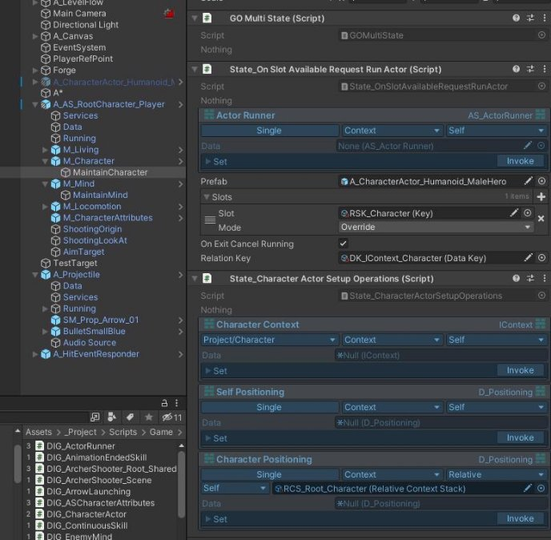

MaintainCharacter is a “table” that deals with character maintenance for the Player actor. When State\_OnSlotAvailableRequestRunActor is called, this Character aspect is handed over to another actor, shown below:

And when that Actor runs, let's see what happens:

It has some services. Remember what services do? They manage some sort of logic for the lifetime of an Actor.

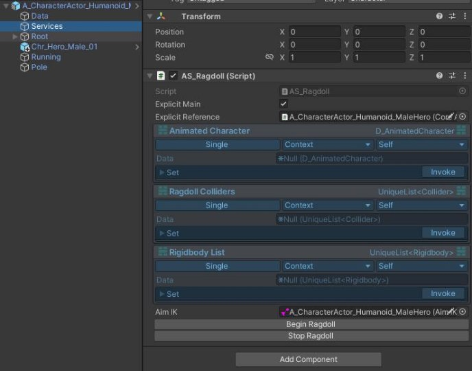

A character actor can have a ragdoll behaviour, so when our Root actor hands over control of its character aspect to this actor, a service under it manages the ragdoll behaviour aspect. Nice!

So, how does this work? Let's take a look at how State\_OnSlotAvailableRequestRunActor behaves.

public class State\_OnSlotAvailableRequestRunActor : MonoActorState {

`    `[SerializeField] private DataField<AS\_ActorRunner> \_actorRunner;     [SerializeField] private GameObject \_prefab;

`    `[SerializeField] private List<SlotOccupationInfo> \_slots;

`    `[SerializeField] private bool \_onExitCancelRunning = true;

`    `[SerializeField] private DataKey \_relationKey;

If you remember, we can pull services like data (we can actually pull pretty much anything but it's not recommended).

We pull the AS\_ActorRunner service, which handles actor running operations. It consists of slot occupying/overriding logic and also it will bookkeep what is running and what they are.

For more information about its internal operations, check its page. What we need to focus on here is this one function:

private void TryRunActor()

{

`    `if (\_finishFrame == Time.frameCount) return;

`    `Debug.Log("Try run " + \_prefab.name);

`    `if (\_isActorRunning)

`    `{

`        `return;

`    `}

`    `Debug.Log("\_isActorRunning passed");

`    `if (!\_actorRunner.Data.CheckSlotsEmpty(\_slots))     {

`        `return;

`    `}

`    `Debug.Log("slot check passed");

`    `if (Actor.IsBeingDestroyed) return;

`    `ActorRunResult runResult = \_actorRunner.Data.RequestRunning(new ActorRunningArgs()

`    `{

`        `DoNotParentToUser = false,

`        `UsageRequestID = "State\_OnSlotAvailableApplyLocomotion",

`        `OccupationInfos = \_slots,

`        `PrefabOrInstance = \_prefab,

`        `RelationKey = \_relationKey

`    `});

`    `\_runningActor = runResult.RunningInstance;

`    `\_isActorRunning = runResult.IsSuccess;

`    `Debug.Log("run result = " + \_isActorRunning);

}

At the start, we are trying not to restart an actor in the same frame that it finished because it will result in a looping behavior. If we are already running an actor, we also prevent re-runs.

We also check ourselves if the slots are empty.

Also, we don’t want to create any new actors when our root one is being destroyed. And then we call the RequestRunning method inside the AS\_ActorRunner service. We have a couple of things to set here;

UsageRequestID = "State\_OnSlotAvailableApplyLocomotion",

This is used for identifying who/why/when an actor is actually being requested. We can implement a logic that can intercept and recognize certain request IDs and perform some specific actions as well.

OccupationInfos = \_slots,

Which slots will this Actor run operation occupy? You can think of these slots as the aspects we discussed earlier, or as something more unique for your specific situation. Use your best judgment here.

PrefabOrInstance = \_prefab,

We can either give a poolable prefab, or an instance ready to be used.

This is useful when you want to override certain prefabs within a prefab and then use them without creating new prefabs for each configuration. RelationKey = \_relationKey

Remember our DataField addresses? There was this thing called relative. If we provide a relation key, ActorRunner will register this new actor's context with that key to our context.

Now, we can access the character's data from our root object.

protected override void OnExit()

{

`    `base.OnExit();

`    `if (\_onExitCancelRunning)

`    `{

`        `if (\_isActorRunning)

`        `{

`            `\_runningActor.CancelIfNotEnded ("State\_OnSlotAvailableApplyLocomotion");

`            `//This should trigger top side OnActorEnded.

`        `}

`    `}

`    `\_actorRunner.Data.onUsedActorEnded -= OnActorEnded; }

You must always clean up your table, so on exit you should not let the actor continue running. Because our root actor is telling that it no longer wants to give you that control.

StateMachine Implementation

I love state machines; they provide the best clarity for data, in my opinion. Now let's examine the design:

What makes a state machine great?

A state machine encapsulates logic for transitioning between states based on data. This can be visualized really well in Unity. State machines create multiple branches and are a vital part of creating any kind of logic tree.

They are the most formidable and reliable way to create tables of aspects for an Actor.

With these praises, what will make a state machine great?

A state machine should only rely on itself when it comes to transitioning.

It should never have public functions like SetState or listen to events like OnRequestSetState, etc.

It should contain every piece of logic for transitioning.

Imagine a car running with its engine; would you stick your hand inside and help it run? Absolutely not. So, view StateMachine in the same way.

StateMachines contain three crucial parts: Transition, Condition, and State.

Transitions contain a Condition, as well as From State and To State references.

Let’s see some code;

[System.Serializable]

public class StateMachine

{

`    `[ShowInInspector][ReadOnly]

`    `//Make sure you don't have circularity.     private bool \_recursiveEvaluate = true;

`    `private IActor \_actor;

`    `public IActor Actor => \_actor;

`    `[ShowInInspector][ReadOnly]

`    `private readonly Dictionary<IActorState, List<IFSMTransition>> \_direct = new Dictionary<IActorState, List<IFSMTransition>>();

`    `[ShowInInspector][ReadOnly]

`    `private readonly List<IFSMTransition> \_any = new List<IFSMTransition>();

`    `[ShowInInspector][ReadOnly]

`    `private IActorState \_currentState;

Let's focus on \_direct and \_any.

If you recall our Standard States page, there were two forms of adding a transition.

The Direct dictionary holds a key of type IActorState, which will be used with \_currentState.

The Any dictionary only holds a list of transitions that will always be evaluated when the state machine is evaluated. A state machine must have one and only one current state.

Now, let's see what happens when we install transitions.

public void InstallTransitions(List<IFSMTransition> transitionList) {

`    `for (var i = 0; i < transitionList.Count; i++)

`    `{

`        `var transition = transitionList[i];

`        `if (transition.ToState == null)

`        `{

`            `transition.ToState = new EmptySimpleState();

`        `}

`        `else

`        `{

`            `transition.ToState.TryInitializeIfInitializedSubState();

`        `}

`        `if (transition.FromState != null)

`        `{

`            `transition.FromState.TryInitializeIfInitializedSubState();

`            `if (\_direct.ContainsKey(transition.FromState))

`            `{

`                `\_direct[transition.FromState].Add(transition);

`            `}

`            `else

`            `{

`                `\_direct.Add(transition.FromState,new List<IFSMTransition>(){transition});

`            `}

`        `}

`        `else

`        `{

`            `\_any.Add(transition);

`        `}

`    `}

}

A state machine transition cannot have a null "to" state; it must always have some sort of destination configured. Here at the 8th line, we are filling it with an Empty state reference that will do nothing.

Why? Well, maybe we are reusing an FSM and don't want to implement each state at this stage. But we also want to run its logic. As you can see, we are automatically initializing states that get registered.

Much like States, we have Enter and Exit functions defined for ease of use in any type of structure. We can have as many as we want. It's not inheriting from IActorState; instead, it's aggregating.

public void Enter(IActor actor, IActorState initialState) {

`    `\_actor = actor;

`    `\_currentState = initialState ?? new EmptySimpleState();     \_currentState.CheckoutEnter(Actor);

}

public void Exit()

{

`    `\_currentState.CheckoutExit(); }

Now let’s see where the magic happens;

public void Evaluate()

{

`    `bool hasSwitchedThisEvaluate = false;     for (int i = 0; i < \_any.Count; i++)

`    `{

`        `IFSMTransition transition = \_any[i];

`        `if (transition.ToState == \_currentState) continue;         if (transition.GetCondition())

`        `{

`            `SwitchState(transition.ToState);

`            `hasSwitchedThisEvaluate = true;

`            `if (\_recursiveEvaluate)

`            `{

`                `Evaluate();

`            `}

`            `return;         }

`    `}

`    `if (!hasSwitchedThisEvaluate)

`    `{

`        `if (!\_direct.ContainsKey(\_currentState)) return;

`        `for (int i = 0; i < \_direct[\_currentState].Count; i++)         {

`            `var transition = \_direct[\_currentState][i];

`            `if (transition.GetCondition())

`            `{

`                `SwitchState(transition.ToState);

`                `hasSwitchedThisEvaluate = true;

`                `if (\_recursiveEvaluate)

`                `{

`                    `Evaluate();

`                `}

`                `return;             }

`        `}

`    `}

}

As you can see, it's a very simple implementation.

Any transitions are given first priority, and they are also prevented from re-entering the same state. If a switch happens during this evaluation, we wait for recursive re-evaluation.

This is done so that we can travel through the tree instantly, and not wait for a frame for each transition if the condition is satisfied. This way, you can use state machines like a flow of operations too.

However, this introduces the problem of stack overflow. You can recursively never escape this evaluation if you have a circularity case. This happens when a switch state also has a case to return back to the state it transitioned from.

I haven't implemented checks for detecting this because there can be many ways to do that, and checks like these may slow down editor testing too. You have to precisely know what will happen with your state machine if you are using this feature. You can turn this off by changing \_recursiveEvaluate to false.

for (int i = 0; i < \_direct[\_currentState].Count; i++) {

`    `var transition = \_direct[\_currentState][i];

`    `if (transition.GetCondition())

`    `{

`        `SwitchState(transition.ToState);

`        `hasSwitchedThisEvaluate = true;

`        `if (\_recursiveEvaluate)

`        `{

`            `Evaluate();

`        `}

`        `return;     }

}

As you can see, we are iterating through transitions one by one to find the first one that satisfies a switch. That's it – the state machine is quite simple.

AS\_ActorRunner Implementation

To know about how it works, we have to look at ActorUsageStandards helper;

public static ActorRunResult TryStartChildActor(

`        `IActor parent, 

`        `IGOInstance prefabOrInstance,

`        `string usageRequestID = "Default",

`        `DelegatedObject<bool> delegatedObject = null,

`        `Action<ActorUsageValidateArgs> evaluateCanStart = null,

`        `Action<ActorUsageEventArgs> startConfirmed = null,

`        `Dictionary<string,List<IActor>> runningDictionary = null,

`        `UniqueList<IActor> runningList = null,

`        `Action<IActor> finishEnded = null, 

`        `Action<IActor> cancelEnded = null,

`        `Action<IActor> beforeStart = null,

`        `bool doNotParentToUser = false,

`        `List<SlotOccupationInfo> occupationList = null,

`        `Dictionary<string,List<IActor>> occupationDictionary = null,

`        `Dictionary<IActor,List<string>> occupierToOccupiedList = null,         InstancePool<List<IActor>> actorListPool = null,

`        `InstancePool<List<string>> stringListPool = null,

`        `string relationKey = null,bool doNotMoveToParent = false)

`    `{

Yes this is just the parameters, I wanted them to be explicitly in users eyes.

If you are using this directly you know what you are doing.

Lets explain,

IActor parent

What will be use to set ParentContext

IGOInstance prefabOrInstance

The actor containing prefab or instance

string usageRequestID = "Default"

Usage request id to intercept logics.

DelegatedObject<bool> delegatedObject = null

This object will be sent through validation event members, and if the final boolean result is true, the request for running will be accepted. Action<ActorUsageValidateArgs> evaluateCanStart

This is the method or event that will be invoked to determine running.

Action<ActorUsageEventArgs> startConfirmed

This is the method or event it will invoke upon confirmation, which is useful for pre-initialization and pre-begin operations. Dictionary<string,List<IActor>> runningDictionary = null

The dictionary for bookkeeping, string key will be the GOInstance’s Type ID.

UniqueList<IActor> runningList = null

Unique list to keep running actors regardless of their type id’s.

Useful for many list operating states.

`        `Action<IActor> finishEnded = null,         Action<IActor> cancelEnded = null,         Action<IActor> beforeStart = null,

these are the events about the actor. They have many use cases.

bool doNotParentToUser = false,

Most of the time you want to keep new used actor inside your parent actor. But there is the option not to as well. List<SlotOccupationInfo> occupationList = null

If this new actor is occupying certain aspects of the Actor, provide a list of slot occupations. Dictionary<string,List<IActor>> occupationDictionary

For registrations about occupations.

InstancePool<List<IActor>> actorListPool = null

Pools to use for minimizing performance impact when running new actor and registering it in a list.

string relationKey = null

A relation key, its purpose explained in Actor Running Actors page.

bool doNotMoveToParent = false

Should we also transform.position = parent.transform.position? That’s what it's for.

If we continue with the implementation;

if(parent.IsBeingDestroyed) return new ActorRunResult(){IsSuccess = false};

bool isPrefab = prefabOrInstance.gameObject.IsPrefab(); IActor instanceActor = null;

if (!isPrefab)

{

`    `instanceActor = prefabOrInstance.GetComponent<IActor>();     instanceActor.InitializeIfNot();   

}

As you can see we are determining if given game object is a prefab or not. Next we start validating;

//Validate

bool validated = true;

if (delegatedObject != null && evaluateCanStart != null)

{

`    `delegatedObject.DelegateObject = true;

`    `evaluateCanStart.Invoke(new ActorUsageValidateArgs()     {

`        `UsageRequestID = usageRequestID,

`        `PrefabOrInstance = prefabOrInstance,

`        `DelegateObject = delegatedObject

`    `});

`    `validated = delegatedObject.DelegateObject;

}

If validation is a fail outcome;

if (!validated)

{

`    `Debug.Log("Not validated.");

`    `return new ActorRunResult(){IsSuccess = false}; }

If success, then we go ahead;

If it’s a prefab then we get a pool instance;

var instance = isPrefab ? parent.GOPool.Retrieve(prefabOrInstance. gameObject) : prefabOrInstance;

if (isPrefab)

{

`    `instanceActor = instance.GetComponent<IActor>();

}

Now Occupation logic;

if (occupationList != null && occupationDictionary != null && occupierToOccupiedList != null)

{

`    `Debug.Log("Slotting");

`    `occupierToOccupiedList.Add(instanceActor,stringListPool.Get());     foreach (SlotOccupationInfo info in occupationList)

`    `{

`        `Debug.Log("Evaluating " + info.Slot.ID + " - " + info.Mode);

`        `if (occupationDictionary.ContainsKey(info.Slot.ID))

`        `{

`            `switch (info.Mode)

`            `{

`                `case SlotOccupationMode.Additive:

`                    `occupationDictionary[info.Slot.ID].Add (instanceActor);

`                    `break;

`                `case SlotOccupationMode.Override:

`                    `for (var i = 0; i < occupationDictionary[info.Slot. ID].Count; i++)

`                    `{

`                        `var cancelled = occupationDictionary[info.Slot. ID][i];

`                        `cancelled.CancelIfNotEnded(usageRequestID);

`                        `Debug.Log("Cancelled " + cancelled.name);

`                        `//occupationDictionary[info.Slot.ID].Remove (cancelled);

`                        `i--;

`                    `}

`                    `occupationDictionary[info.Slot.ID].Add (instanceActor);

`                    `break;

`            `}

`        `}

`        `else

`        `{

`            `occupationDictionary.Add(info.Slot.ID,actorListPool.Get());             occupationDictionary[info.Slot.ID].Add(instanceActor);

`        `}

`        `occupierToOccupiedList[instanceActor].Add(info.Slot.ID);

`    `}

}

Let's see what is happening here. If something is an additive one, it won't override or cancel something; instead, it will add on to it. How is this useful? Well, remember there is logic that runs an actor only when a slot is completely empty. This will fill it but not remove any existing one.

However, the override logic is very simple; it will cancel anything that is occupied with that slot key. Next, we set our parent context here:

instanceActor.DataContext.ParentContext = parent.DataContext;

Set relation data;

if (!string.IsNullOrEmpty(relationKey))

{

`    `string relationStringKey = "ActorRelation" + instanceActor. DataContext.ContextID;

`    `parent.DataContext.SetData<string>(relationStringKey,instanceActor. DataContext.ContextID);

`    `parent.DataContext.SetData<IContext>(relationKey,instanceActor. DataContext);

}

Initialize our new actor, and set configured update behaviour to it.

instanceActor.InitializeIfNot();

instanceActor.DataContext.SetData(parent.DataContext. GetData<IConfiguredUpdateBehaviour>());

Raise our startConfirmed method/event;

Then we go ahead and register this actor in our running dictionary.

We also register to it's cancel, finish event to eventually remove it from our bookkeeping. We apply transform parent operations.

And then finally we invoke beforeStart and call its BeginIfNot() method.

After it ends, either by cancel or finish, we catch this and call StandardChildActorRelease This will clean-up everything about ended actor.

This method is fairly straightforward if you know the standard run method.

So as you can see, this service is just a wrapper for this standardized logic.

An example

Let’s look at this system by giving an example that is actually implemented

We will look at 3 Actors, these are Root Player actor, Locomotion Runner actor, Grounded Locomotion actor.

Consider this actor hierarchy of Root player actor

First three things; Services, Data, and Running these are it’s absolute internal components.

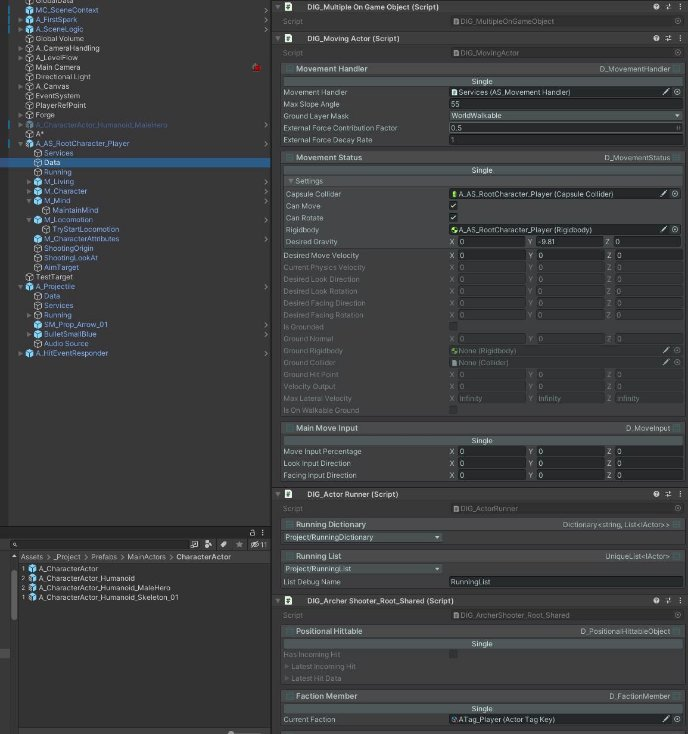

As you can see data holds large number of DataInstallerGroups, MovementHandler data, MovementStatus data, and many more Some are installed as “Single” some are assigned with a key like RunningDictionary.

Lets look at its services;

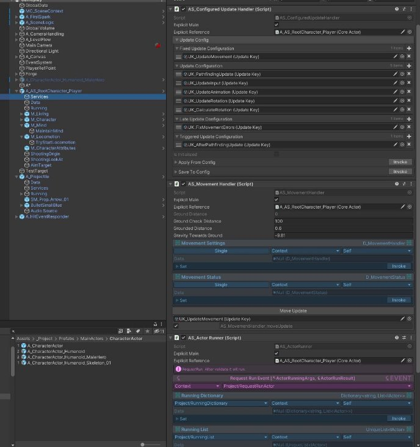

MovementHandler, ActorRunner, ConfiguredUpdateHandler, bunch of services.

Remember that services can hold both logic and data, and extended behaviours that states can use. And running which will be containing the running state

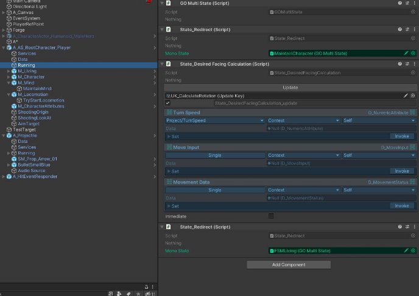

As we can see, we are redirecting some states to other gameobjects. Lets focus on FSMLiving;

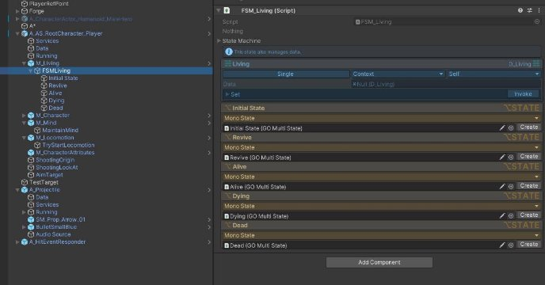

We have a living fsm here with 5 states, Let’s continue with Alive, which is the most probable place for any locomotion logic.

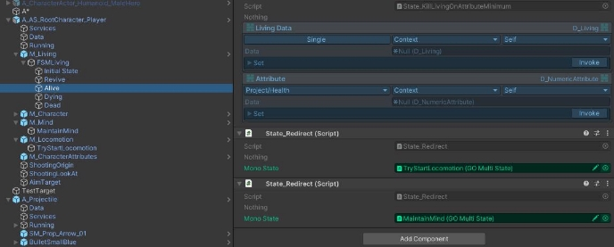

As we can see we are again redirecting here to TryStartLocomotion object. Keep in mind that we are filtering out our control of other parts of this actor as we go deeper in the tree. Let’s move to TryStartLocomotion;

Here we go we are handing over our control for locomotion to A\_UA\_LocRun\_Set1 actor prefab.

Our actor when runs, will override-occupy BaseBody slot. Meaning it will remove anything running.

But only when its completely free, so actually it doesn’t matter what slot configuration we have here for this.

As we can see we are pulling ActorRunner service, that is installed to our context by having [Context, Self] options. And we are pulling the one that is installed as Single, and not by any key. Remember, we had this script in “Services” GameObject.

Let’s move over to locomotion runner actor;

Not every actor will be a huge one, this one is very simple lets look at its Running;

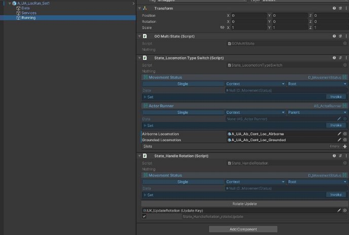

The State\_LocomotionTypeSwitch will use two slotted Airborne and Grounded actor prefabs based on isOnWalkableGround boolean inside

private void UpdateRunningLocomotionType()

{

`    `if (\_currentInstance != null)

`    `{

`        `\_currentInstance.CancelIfNotEnded("State\_LocomotionSwitch");         \_currentInstance = null;

`    `}

`    `if (\_movementStatus.Data.IsOnWalkableGround)

`    `{

`        `var result = \_actorRunner.Data.RequestRunning(new ActorRunningArgs()

`        `{

`            `OccupationInfos = \_slots,

`            `DoNotParentToUser = false,

`            `PrefabOrInstance = \_groundedLocomotion,

`            `UsageRequestID = "State\_LocomotionSwitch"

`        `});

`        `\_currentInstance = result.RunningInstance;

`    `}

`    `else

`    `{

`        `var result = \_actorRunner.Data.RequestRunning(new ActorRunningArgs()

`        `{

`            `OccupationInfos = \_slots,

`            `DoNotParentToUser = false,

`            `PrefabOrInstance = \_airborneLocomotion,

`            `UsageRequestID = "State\_LocomotionSwitch"

`        `});

`        `\_currentInstance = result.RunningInstance;

`    `}

}

We first cancel current running, and then start new one as you can see. Let’s look at something very important,

Consider the Single,Context,ROOT and Single,Context,PARENT

Actually both are, in our current hierarchy, pointing to the same context. Which is player root. Now let's look at Grounded Locomotion,

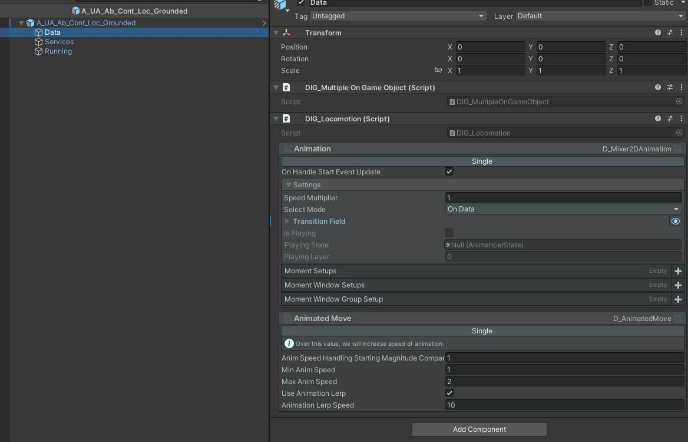

You can see that we installing 2 data to Grounded locomotion actor’s data context. We use these for controlling animations

Let's look at Running;

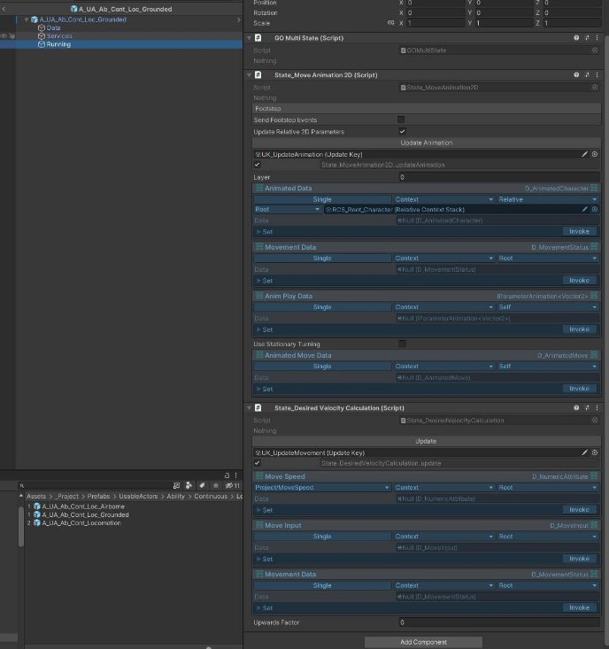

Okay, two states are running here: one is calculating the desired velocity based on input data that sits on our root, which is the player root actor, and the other is controlling the animation based on MovementData on the root and our character actor. Let's focus on that:

Single,Context,Relative ( Root  Stack of [Character] )

So, we go to our root and from there, search for the character. Since this stack contains only one element, we are done searching, and we return that context to be used to get the D\_AnimatedCharacter data, which contains AnimancerComponent and Animator references.

We then use them in this fully modular locomotion actor to handle an aspect of this complete structure. Now, think about having attack abilities, stun disables, knockbacks, etc. Anything is possible.
